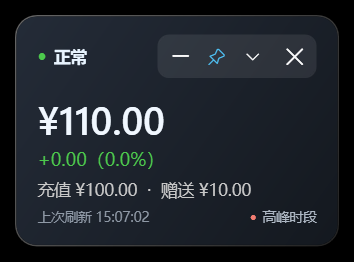

# DeepSeek Balance Widget

一个面向 Windows 11 的 DeepSeek API 余额悬浮小工具。它支持余额轮询、充值与赠送余额明细、低余额及异常下降提醒、迷你胶囊、系统托盘、开机自启和预计峰值时段提示。

[](https://github.com/wanghoufan/DeepSeekBalanceWidget/actions/workflows/ci.yml)
[](https://github.com/wanghoufan/DeepSeekBalanceWidget/releases/latest)
[](https://github.com/wanghoufan/DeepSeekBalanceWidget)
[](https://dotnet.microsoft.com/)



## 下载

前往 [Releases](https://github.com/wanghoufan/DeepSeekBalanceWidget/releases/latest) 下载：

```text
DeepSeekBalanceWidget-v0.1.0-win-x64.zip
```

解压后直接运行 `DeepSeekBalanceWidget.exe`。发布包为 Windows x64 自包含单文件版本，目标电脑无需预先安装 .NET Runtime。

> 第一次启动后，请在设置中填写自己的 DeepSeek API Key。API Key 只保存在当前 Windows 用户的本地配置中，不会上传到 GitHub。

## 主要功能

- 实时显示 DeepSeek API 总余额、充值余额和有效赠送余额
- 显示与上一次成功刷新的金额和百分比变化
- 低余额及异常下降提醒，带冷却机制避免重复打扰
- 完整卡片与迷你胶囊模式，可自由拖动并记忆位置
- 系统托盘状态、置顶、隐藏、开机自启
- 按北京时间显示官方峰值时段参考
- API Key 使用 Windows DPAPI CurrentUser 加密保存

## 日常启动

最方便的方式是双击仓库根目录的：

```text
启动余额监控.cmd
```

首次启动时，脚本会自动生成发布版。之后会直接启动：

```text
release\DeepSeekBalanceWidget.exe
```

不要从 `src\...\bin\Debug\...` 启动日常使用版本。该目录属于开发构建缓存，路径和文件随编译变化。

## 发布

在 PowerShell 中运行：

```powershell
.\scripts\publish.ps1
```

脚本会生成 Windows x64、自包含、单文件发布版本：

```text
release\DeepSeekBalanceWidget.exe
```

自包含版本无需目标电脑预先安装 .NET Runtime。发布文件体积会明显大于 Debug 目录里的 apphost，这是正常现象。

发布脚本支持 Windows x64 和 Windows ARM64：

```powershell
.\scripts\publish.ps1 -Runtime win-arm64
```

## 开发

环境要求：

- Windows 11
- .NET 8 SDK
- Visual Studio 2022、Rider 或 VS Code（可选）

构建与测试：

```powershell
dotnet build DeepSeekBalanceWidget.sln
dotnet test DeepSeekBalanceWidget.sln
```

运行 Mock：

```powershell
dotnet run --project .\src\DeepSeekBalanceWidget -- --mock-scenario sequence
```

## 项目结构

```text
.
├─ src/                    源代码
├─ tests/                  自动化测试
├─ docs/plans/             历次方案与审查记录
├─ artifacts/ui-audit/     UI 前后对照截图
├─ scripts/                构建与发布脚本
├─ release/                本地发布产物，不提交 Git
├─ DeepSeekBalanceWidget.sln
├─ README.md
└─ 启动余额监控.cmd
```

## 配置与安全

用户配置保存在：

```text
%APPDATA%\DeepSeekBalanceWidget\config.json
```

API Key 使用 Windows DPAPI 的 CurrentUser 范围加密。配置文件、API Key 和本地发布产物不会提交到 GitHub。

本项目不会把 API Key 写入源代码、日志或 GitHub Actions。请不要把 `%APPDATA%\DeepSeekBalanceWidget\config.json` 提交或发送给其他人。

## 开机自启

开机自启记录当前正在运行的 EXE 路径。建议先运行 `release\DeepSeekBalanceWidget.exe`，再在设置中启用开机自启，避免注册表继续指向 Debug 构建目录。

## 文档

设计方案、迭代记录和审查意见位于 [docs/plans](docs/plans/)。

版本变化记录见 [CHANGELOG.md](CHANGELOG.md)。
